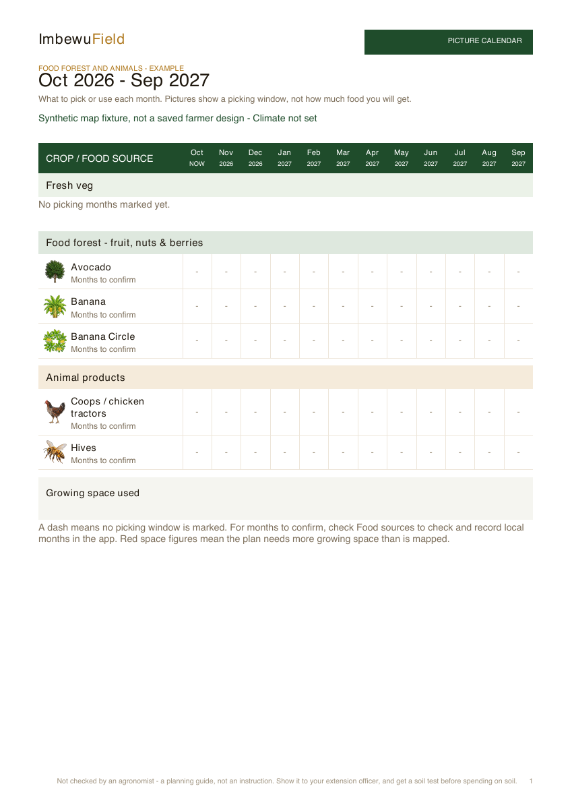
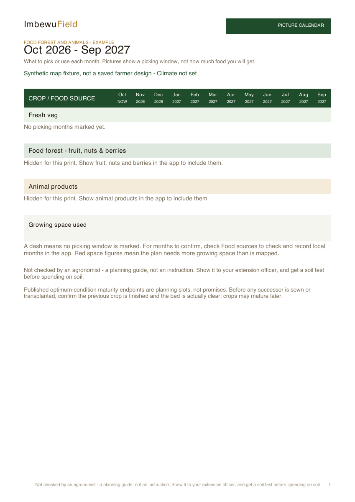

# Production-plan section visibility — 3 October 2026

- Auditor: Codex.
- Reviewed revision: `87231f7453a2d74456f7a861c31e251ceb680bd3`, branch `codex/production-empty-sections-20261003`, based on production `0661ce4d38ed77099c3db6ecce6ea5ecb8312d7e`.
- Previous audit: [Timing narrative](../2026-10-02/production-timing-narrative-codex.md). CP-015 remains closed; this is a separately reproduced omission.
- Scope: the actual PDF availability renderer, its chart-switch adapter and farmer/reference exports. App headings already exist below bed and staple rows.
- Evidence: source review, the downloaded 2 October public-sample PDF, actual jsPDF exports, rendered PNGs and full tests. Release confirmation is recorded on issue #35 after CI and deployment.

## Finding and disposition

| ID | Problem | Disposition and evidence |
| --- | --- | --- |
| CP-016 | A section without locally confirmed production months was filtered out of the printed picture calendar. The public-sample PDF showed trees only in the later inventory, and no animal section. Rory asked where animal and food forest products were. | Implemented and locally verified: food forest and animal headings remain, undated mapped sources have named calendar rows marked “Months to confirm”, and all their month cells remain unmarked. |

The previous omission assertion was a stale presentation claim, not a timing rule. It was rewritten with this reason: retain sections while proving that missing canvas information cannot create dated products. The original dated-sowing checks remain. Two actual-PDF regressions cover undated banana/hive/coop rows in the calendar itself and explicit switch-off behaviour. The adapter carries both chart switches so hidden products do not become unknown-date rows or leak into the inventory and jobs.

Confirmed months, production quantities, species identities and saved geometry are unchanged. A housing row identifies a structure; it is not evidence of animals or harvests. Proposed sources remain dated only through the existing confirmed-source authority. No egg forecast or honey-flow dates were added.

## Verification

- TypeScript passed.
- Full suite: 4,509 tests, 4,508 passed, zero failures, one existing shape-sync-loss TODO. `git diff --check` passed.
- Rendered and inspected mapped, empty and explicitly hidden exports. The mapped fixture uses the existing avocado, banana clump/circle, beehive and chicken-coop catalogue elements, with no confirmed months or vegetable beds. It is a synthetic fixture, not Rory's private Ubhejane design.
- The first render exposed notes too close to section headings; the note spacing was corrected and all three outputs were rendered again. Mapped plant/housing rows, icons, wrapping and hidden-section explanations are visible without overlap.
- This changes the picture. `PLAN_VERSION` remains unchanged.





Reproduce the PDFs from the repository root on Node 24:

```sh
node --import ./tests/register-alias.mjs docs/audits/2026-10-03/evidence-production-empty-sections/render-fixture.mjs
```

## Limits and continuation

Private Ubhejane save/reopen, physical-device testing and source gaps carried forward from the earlier audit remain unverified. The public sample lacks Rory's private hives and coop; its name is not proof that it is his saved design. Check the farmer's own design selection and mapped source import if those sources remain absent in the app. Do not substitute a synthetic fixture for that check.

After publication, refresh and download a new PDF; older downloaded files retain the old omission. In the app, Fruit, nuts & berries and Animal products follow the bed/staple rows. In the PDF, Food forest and Animal products follow the vegetable availability rows in Picture calendar.
