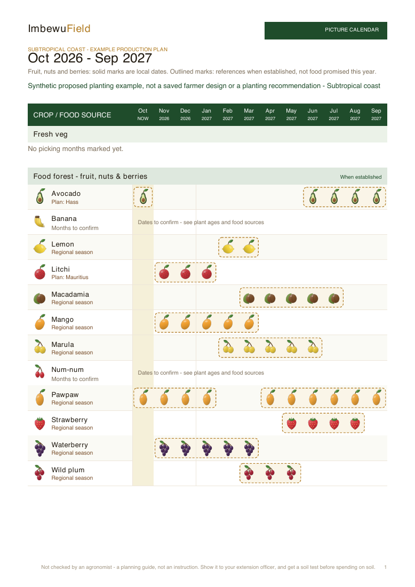
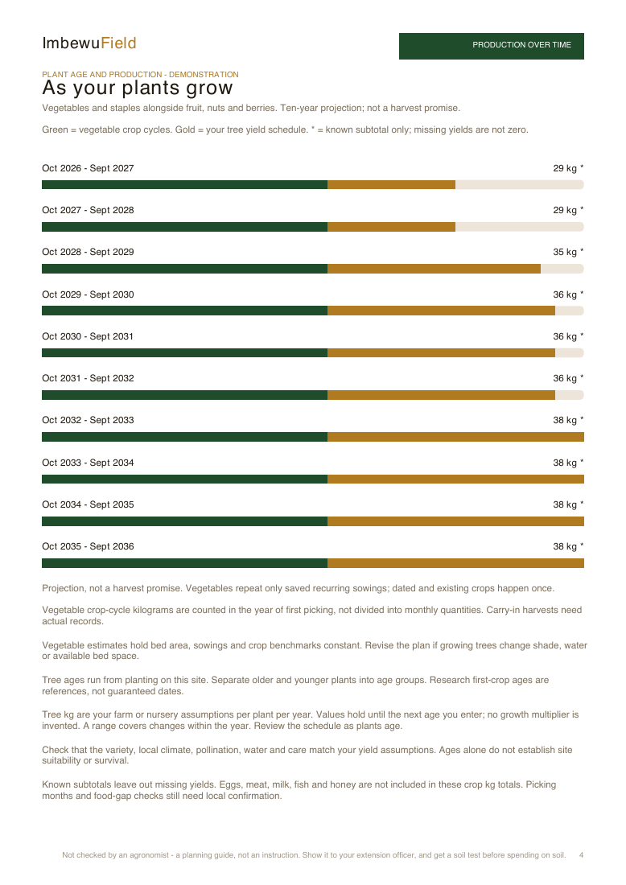
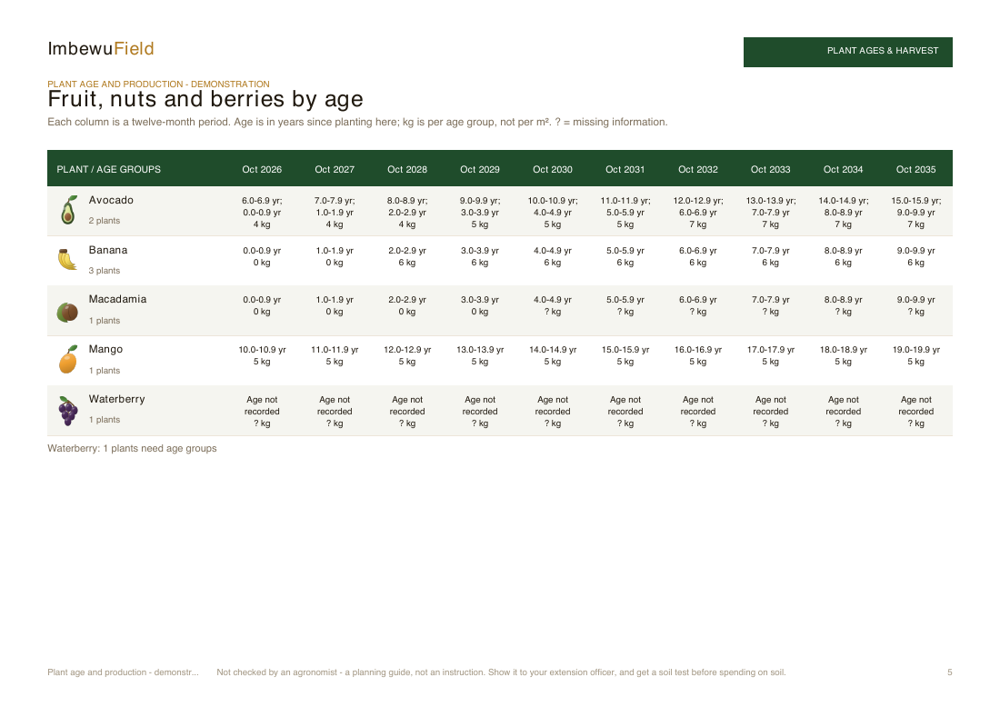
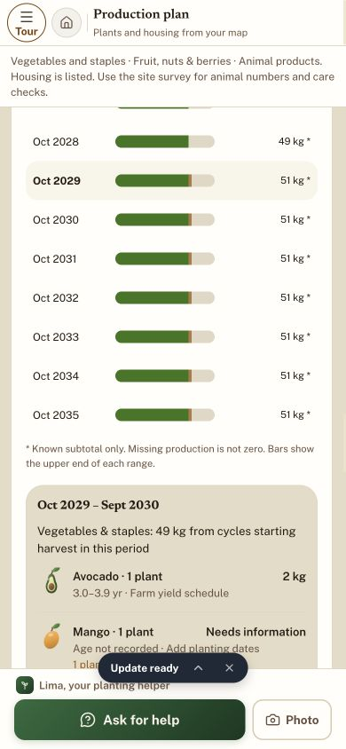

# Production by plant age and clearer graphics — 4 October 2026

- Auditor: Codex. Base `e796af601fd984f534ea29908ad7bf120e2df512`, refreshed with `998ed1d9` before publication.
- Branch: `codex/production-age-visuals-20261004`. Publication and exact revision recorded on issue #35.
- Previous: [Regional production calendars](regional-production-calendar-codex.md). CP-017–CP-025 retained.
- Scope: plant age controls, ten-year crop kg projection, dated calendar references, native fruit art and PDF layout.

## Findings

| ID | Gap | Change and evidence |
| --- | --- | --- |
| CP-026 | Flat small product art and a separate dashed box for every picking month made the calendar busy. | Existing 36 SVGs have soft shading; avocado stone and waterberry clipping corrected. Larger app icons; contiguous outlined print seasons, quieter rows and blanks. Existing species and silhouettes retained. |
| CP-027 | Plants of different ages had no future production model beside vegetables. | Separate existing/proposed age groups record planting month and count, plus explicit farm/nursery kg per plant per year at specified ages. A single pure projection supplies app and PDF for ten rolling years. Known older cohorts remain in subtotals even if younger cohorts need yields. |
| CP-028 | Established seasonal references could look like harvest from newly planted trees; year two said every year after. | Recorded complete age groups qualify reference months, never observed existing harvest. Whole immature periods use sourced first-crop age with an explicit reference label. Crossing first-crop age without kg stays unknown. Year two now says repeat crops and check plant ages. |
| CP-029 | Browser month input did not update the age model reliably; storage failure was silent. | Separate month/year selectors verified in the actual app. Existing account/site-local persistence retains age groups; unavailable storage produces a visible warning. |

## Projection rules and limits

No researched mature yield is automatically assigned to a young tree. Existing sourced first-crop/established-age references are linked beside controls; farm kg schedules hold until the next entered age, with ranges when a checkpoint changes within the period. No invented linear curve or growth multiplier. Missing dates, missing yield schedules, excess counts, duplicate ages and future dates for existing plants remain explicit. A missing quantity is not zero.

Vegetable crop-cycle benchmarks are allocated to the year first picking starts. Existing and dated sowings happen once; saved recurring sowings repeat. Carry-in crops are not silently assigned a whole future crop-cycle yield. Double-booked beds block the combined benchmark. This holds bed space and management constant; tree shade, water, survival, cultivar and climate changes require revising the assumptions. Annual kg are not monthly harvest weights. Eggs, meat, milk, fish and honey retain their existing distinct product guidance and are explicitly excluded from crop kg.

Plant ages and schedules remain in the same account/site-local device store as picking months. This is not cross-device synchronization. The real private Ubhejane design and its ages were not retrieved. Public sample inputs and synthetic fixtures do not represent the farmer's yield records. Sources still have gaps across species and climates; this does not claim a researched age-to-yield curve for every plant.

## Verification

- TypeScript clean, then full suite: **4,579 tests, 4,578 passes, zero failures/cancellations/skips, one pre-existing shape-sync TODO**; 57.40 seconds. Whitespace clean. Final-head CI also required before merge.
- Meaningful regressions cover immature/mature/mixed cohorts, checkpoint transitions, missing dates, malformed counts/rates, persistence isolation/failure, dated one-off crops, recurring crops, space conflicts, known older subtotal and app/paper age qualification. The old test asserting an annual-only 'every year after' heading was rewritten to protect repeated crops plus advancing plant ages; it still rejects an indefinite blanket claim.
- Actual public sample browser: selecting Oct 2026 for avocado removed premature reference bars; entering artificial age 0 = 0 kg and age 3 = 2 kg changed Oct 2029 to 49 vegetable kg + 2 test tree kg = 51 kg known subtotal. Native farmer PDF downloaded successfully with identical figures. Artificial kg are test inputs, not agricultural advice.
- Desktop and **390 × 844 phone** graph/age details visually checked; temporary viewport reset. No private save/reopen or physical device check.
- Eight regional examples plus unknown-climate control regenerated with existing research rules: coast, Lowveld, Midlands, Western Cape, Highveld, Karoo, Southern Cape, high mountain. All nine first pages visually checked; unsupported seasons remain unmarked. No claim that all products suit all regions.
- Eleven final PDFs (nine regional, synthetic mixed-age demonstration, native public sample with artificial ages): **72 pages, zero text characters outside page boundaries**. Picture calendars, age graph/table and headed assumptions/source pages inspected. Compact animal group keeps coop and hive together at a break.









[All regional calendars](evidence-production-age/regional-contact.png) · [Age source page](evidence-production-age/age-production-demonstration-6.png)

This changes the picture. `PLAN_VERSION` is unchanged. No saved geometry, species names, legal flags, course bodies, synchronization modules or deployment workflows were changed. Native SVG improvements are not the still-pending painted PNG artwork commission. Existing generator is unchanged; `refine-fruit-vectors.mjs` reproduces this refinement after generation.

Reproduce with Node 24, alias loader and sharp available:

```sh
NODE_PATH=/path/to/node_modules node --import ./tests/register-alias.mjs docs/audits/2026-10-04/evidence-regional-calendar/render-fixture.mjs output/pdf/production-age-visuals-2026-10-04
NODE_PATH=/path/to/node_modules node --import ./tests/register-alias.mjs docs/audits/2026-10-04/render-age-projection.mjs
```

Generated PDFs are excluded from Git; durable screenshots and reproduction helpers are included. Continue the site survey audit with real stock/planting dates, nursery provenance, chilling/soil/water/pollination and locally verified cultivar/yield advice. Do not turn the demonstration schedule into default recommendations.
