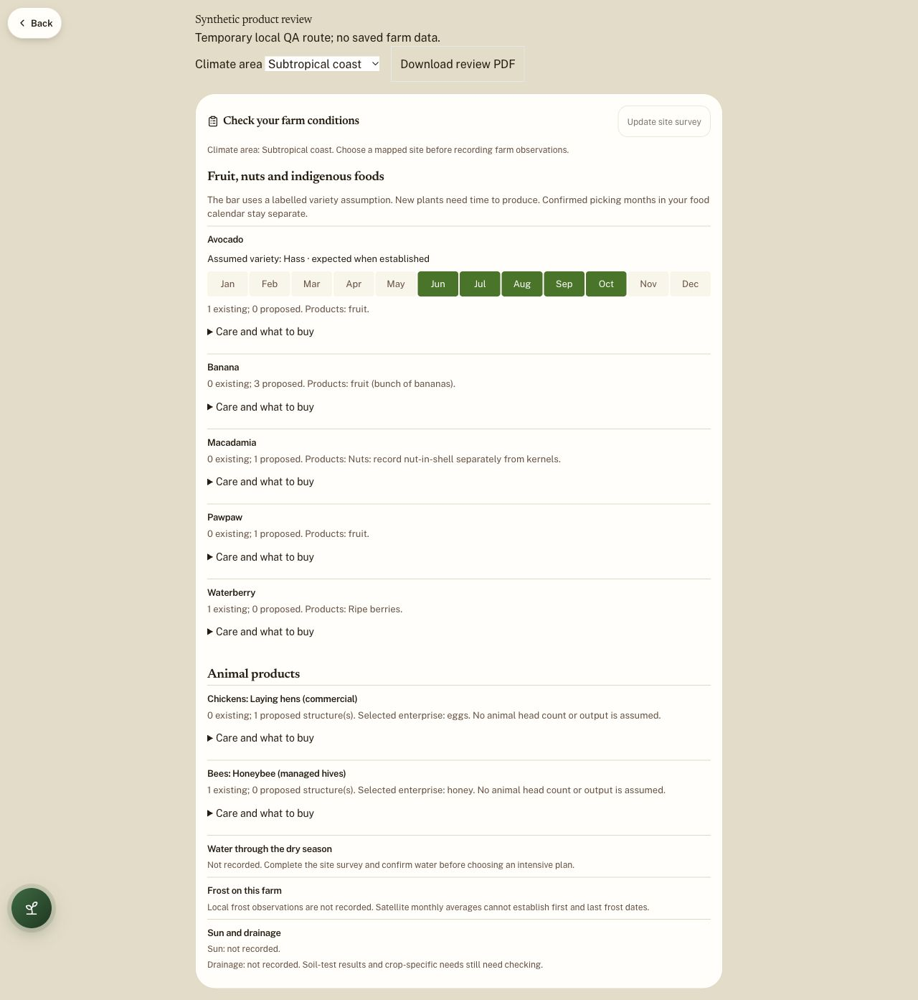
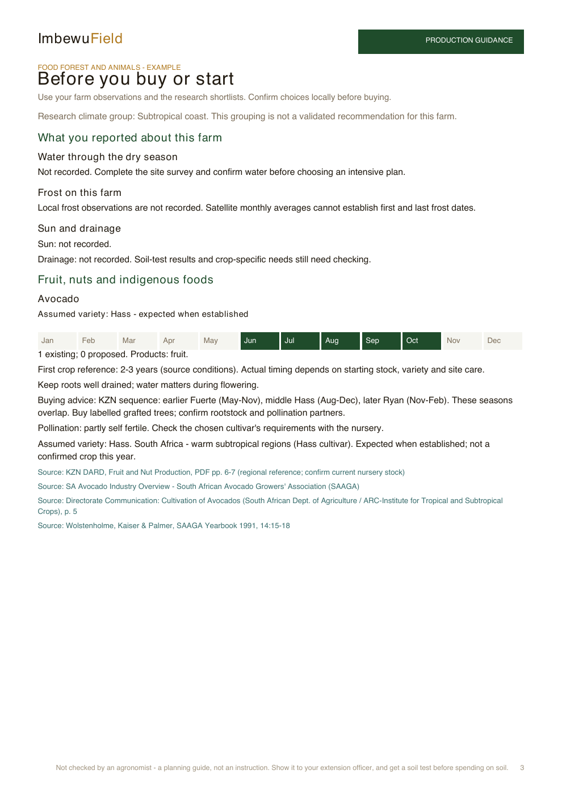
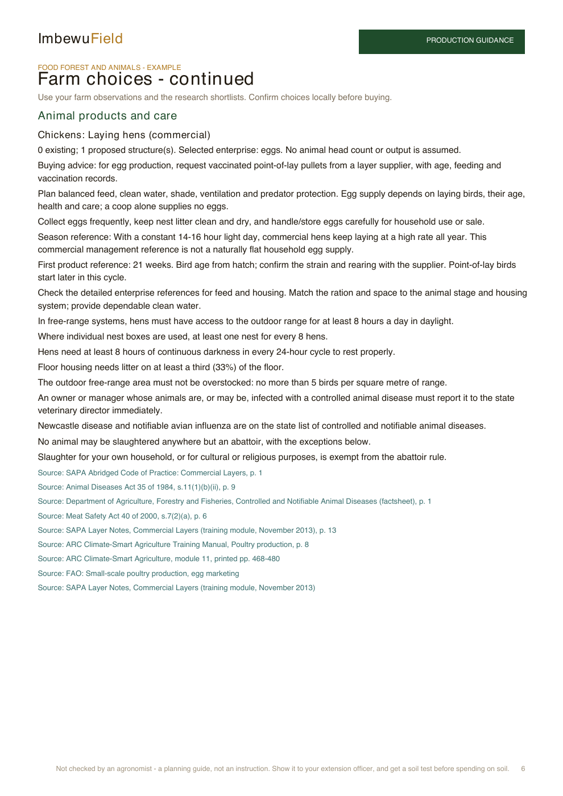

# Individual production products and variety assumptions — 4 October 2026

- Auditor: Codex. Branch: `codex/food-forest-animal-research-20261004`, based on `3c134599985e9ccf46272914ad9d5af270309ce7`.
- Previous record: [Printed section visibility](../2026-10-03/production-empty-sections-codex.md). CP-016 remains implemented; this extends product guidance rather than changing the confirmed-food calendar.
- Scope: mapped food forest and animal enterprises, app guidance, farmer PDF, site-report purchasing input and early/middle/late variety handling.
- Request: research individual products, indigenous foods and locally appropriate stock; treat a banana circle as three planted bananas; put purchasing choices in the site report and label crop-plan assumptions.

## Findings and disposition

| ID | Finding | Implemented behaviour |
| --- | --- | --- |
| CP-017 | Mapped products lacked individual buying and care guidance. | Shared sourced profiles for 33 existing catalogue identities; generic dossier-backed guidance for other mapped plants. All 15 existing animal enterprises have sourced care/selection guidance. Housing alone cannot imply livestock or output. |
| CP-018 | Banana circles remained an unidentified, separate production entry. | Circle represents three proposed/existing planted bananas according to its saved status, grouped with ordinary bananas. Followers do not increase planted counts. No saved geometry changes. |
| CP-019 | Several first-production references were misleading. | KZN banana reference 13–20 months; papaya about 18 months with favourable Makhathini 9–11 months explicitly conditional; macadamia first crop 4–5 years. Commercial layer reference corrected from receiving age to 21 weeks from hatch. |
| CP-020 | A species-wide union can make one avocado look productive almost all year. | One labelled Hass assumption: warm reference June–October, cool reference August–December. Unknown, contradictory climate or unsuitable observed frost/drainage/shade suppresses an assumed bar. Proposed production never enters confirmed food-gap arithmetic. |
| CP-021 | Site reports could lose species identity and blur buying succession with picking dates. | Canonical mapped identities/status and selected enterprise choices enter the report separately from display labels. Source-grounded purchasing appendix and suitable-plants prompt distinguish picking succession, flowering compatibility and area fit. |

Early/middle/late is used only when a source establishes the order. KZN avocado purchasing guidance offers earlier Fuerte, middle Hass and later Ryan with overlapping reference windows. Banana varieties instead depend on temperature and wind. Raspberry pruning/bearing systems and pecan/plum flowering compatibility remain separate checks. No fabricated succession is supplied for an indigenous species without named selections.

The app keeps counts and labelled assumed bars visible, with care and buying advice expandable. The farmer PDF repeats the twelve labelled months and retains clickable source references. Animal care explains products, starting age, clean water/feed, eggs, lactation or colony flow as appropriate; detailed feed/space benchmarks stay in enterprise references rather than becoming universal ration instructions.

## Source review

Primary sources used include KZN DARD Fruit and Nut Production (43-page PDF), KZN banana trials; ARC Climate-Smart Agriculture modules 6 and 8–12; SAMAC harvesting guidance; SAPPA cultivar-by-area table; Citrus Academy; ARC/Culdevco cultivar sheets; USDA blueberry breeders and release information; producer Fall Creek's SA nursery information; SANBI PlantZAfrica and FAO.

Important page checks: KZN PDF 8 banana cycle, 18–19 papaya, 24–25 macadamia; ARC poultry PDF 8 / printed 467 distinguishes point-of-lay birds from first eggs. First-crop figures were changed in the research dossiers and regenerated using existing generators. Source quotes remain short. The ARC first-egg page was rendered and visually inspected.

Retrieval limits: some SANBI pages and PubHort's full Biloxi page blocked direct requests; primary search text/abstract was reviewed. The historical DAFF 2012 grape PDF could not be downloaded reliably; its primary search excerpt supports the industry sequence, accompanied by current SATI region information. A dead BerriesZA PDF was excluded. Nursery availability, province-wide winners and precise local harvest dates are not inferred from these sources. Moringa material's nitrogen-fixing claim was not repeated.

## Evidence and verification

Synthetic fixtures explicitly identify themselves; they are not Rory's saved Ubhejane farm. Warm, cool and unknown PDF exports were rendered: 7, 5 and 5 pages respectively, with zero characters outside page boundaries. The first visual pass exposed an orphan animal heading and verbose research calculations; these were corrected and re-rendered. App testing covered warm/cool/high-mountain changes, native PDF download and a 390-pixel mobile viewport. The viewport override was reset. A public Ubhejane sample was also opened through ordinary app navigation; it lacks the private farm's banana/hive/coop placements.

Final required checks are recorded in the publication ledger on issue #35. Regression coverage checks every climate group, all animal enterprises, compatible choices, immutability, banana aggregation, actual-versus-assumed dates, indigenous edible parts, printed month/source wiring and report identity preservation.

This changes the picture. `PLAN_VERSION` remains unchanged. Temporary QA route, downloaded source PDFs and test logs are excluded from the commit.







Reproduce on Node 24:

```sh
node --import ./tests/register-alias.mjs docs/audits/2026-10-04/evidence-production-products/render-fixture.mjs output/pdf/production-products
```

## Limits and next work

The private Ubhejane design has not been retrieved or save/reopen tested. No paid AI report generation was invoked: report input, deterministic purchasing output and prompt wiring were checked. isiZulu report bodies receive the translation reference; the English appendix is not appended to an isiZulu report. Native isiZulu wording has not had a fluent review.

Some mapped species still have no locally verified cultivar, yield or picking window; these remain explicit gaps. The site-survey deep audit remains separate work. Actual cultivar recording, planting dates, animal numbers, stock age, local frost/chilling and nursery confirmation are still needed before a farm-specific production forecast can replace the labelled assumptions.
