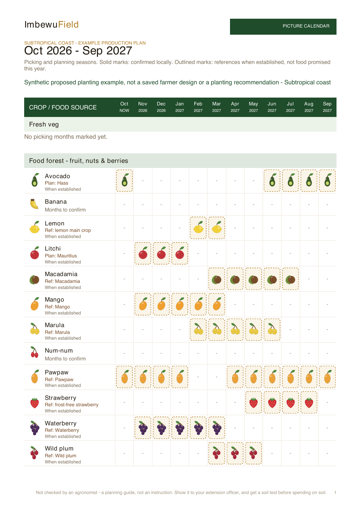
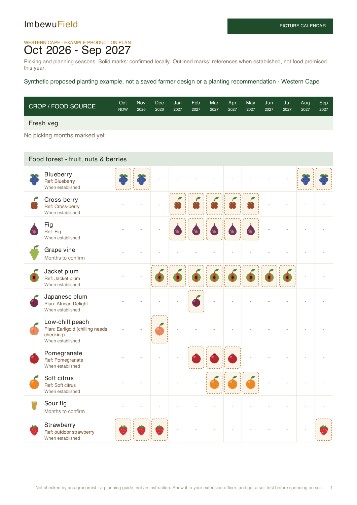
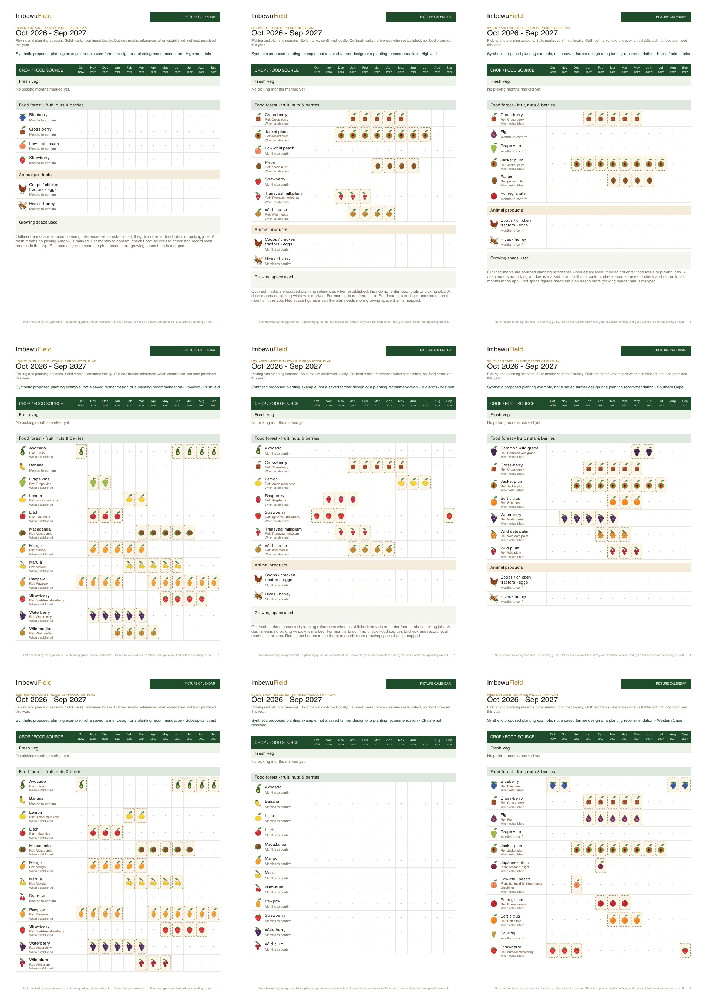

# Regional production picture calendars — 4 October 2026

- Auditor: Codex.
- Reviewed base: `d7281d62f740fdd3cce0658404def04be9c1e6ff`; branch `codex/regional-production-calendar-20261004` with the changes described here.
- Previous audit: [Individual products and variety assumptions](production-products-codex.md). CP-017–CP-021 remain implemented; this fills the separate main-calendar gap.
- Scope: app bed calendar, farmer/quick/reference PDF picture calendars, source windows and eight regional examples. Deployment and final revision are recorded on issue #35 after publication.
- Evidence: primary-source review, regression tests, real browser export, 390 × 844 viewport and rendered PDFs.

## Findings and disposition

| ID | User-visible gap | Disposition and evidence |
| --- | --- | --- |
| CP-022 | Researched planning seasons existed in guidance but the main picture calendar still showed dashes. | App and PDF now draw distinct outlined references for established plants. The shared `planningTreeSeasons` builder supplies both. A local confirmation replaces the entire reference, preventing extra assumed months from extending the farm's confirmed season. Confirmed food totals and picking jobs remain separate. |
| CP-023 | A general national season can combine climates, cultivars or production systems. | One applicable source window per reference. Lemon hot/cool main crops are separate; outdoor/tunnel strawberries are separate; spring/autumn raspberry systems are separate. Mauritius litchi excludes later Wai Chee months. Unsupported climates and contradictory inferred zones retain explicit missing dates. |
| CP-024 | Tree pictures and berry letter codes differed from the app's product pictures. | Printed product rows reuse existing fruit/nut/berry SVGs. Browser SVG decoding and the real exported PDF were checked. Plants without product art retain their own available plant picture. No new species or artwork catalogue entries. |

References are conditional planning analogues, **not area suitability recommendations**. Broad climate groups do not establish soil, chilling, altitude, cultivar, pollination or microclimate. Source-region names and qualifiers remain visible in the app explanation and PDF source appendix. No reference is promoted into a quantity, income, picking job or first-year food promise.

## Source decisions

Existing research dossiers supply the seasonal evidence. Sources include KZN DARD, ARC/DAFF avocado guidance, NAMC mango industry data, SAMAC, Citrus Academy, ARC/Culdevco, strawberry producers, Western Cape blueberry trials and indigenous plant references. The explicit regional compatibility rules are editorial inferences for displaying those references; they are not validated farm recommendations.

New primary retrieval: [SALGA cultivar guide](https://litchisa.co.za/cultivars-2/), credited to ARC-ITSC Nelspruit. Fay Zee Siu: mid-November–mid-December; Mauritius: mid-November–early-January; Wai Chee: end-January–end-February. The dossier includes these cultivar windows and was regenerated with the existing generator. A touched partial month appears in the monthly reference; it does not imply production throughout every day of that month. First-bearing age, yield and chilling gaps remain unresolved.

Banana's 13–20-month first-bunch reference is elapsed time, not a fixed annual picking season. It therefore stays unmarked without local dates. A banana circle remains three planted bananas grouped in the Banana row. Empty coops and hives do not imply hens, populated colonies, egg dates or a national honey season.

## Regional examples

All examples are **synthetic proposed plantings**, full sun, well drained and reliable dry-season water. They are not saved Ubhejane records or proposed purchases. Frost is marked yes for Midlands, Highveld, Karoo and high mountain; no elsewhere. The light-frost strawberry reference explicitly needs local severity confirmation.

| Climate example | Mapped plant types | Types with reference months |
| --- | ---: | ---: |
| Subtropical coast | 12 | 10 |
| Lowveld / Bushveld | 12 | 11 |
| Midlands / Mistbelt | 7 | 6 |
| Western Cape | 11 | 9 |
| Highveld | 7 | 5 |
| Karoo / arid interior | 6 | 3 |
| Southern Cape | 7 | 7 |
| High mountain | 4 | 0 |
| Climate unresolved (control) | 12 | 0 |

The examples contain 28 distinct existing catalogue identities. Coverage is not a claim that every species can grow in every climate. All example confirmed-food slots remain empty. [Manifest](evidence-regional-calendar/sample-manifest.json) records actual plant identities, assumptions, months and sources.







## Verification

- TypeScript clean; full suite: 4,560 tests, 4,559 passes, zero failures/cancellations/skips, one pre-existing shape-sync TODO; 59.00 seconds. Whitespace check clean.
- All nine regional PDFs generated using the real export builder: 37 pages total, zero text characters outside page boundaries. All first calendar pages visually inspected; representative inventory and source pages also inspected. This is not a claim of an agronomist review.
- Real public Ubhejane sample opened through ordinary browser navigation. Outlined Avocado/Mango references and their explanation were inspected. The native quick PDF exported successfully: nine pages and 79 image draws; fruit pictures, rolling months and reference labels were inspected.
- Phone viewport checked at 390 × 844. The first pass clipped the new legend; its width now follows the visible phone area and was rechecked. Temporary viewport override reset. [Desktop](evidence-regional-calendar/app-reference.jpg) and [phone](evidence-regional-calendar/app-mobile.jpg) evidence preserved.
- Regression tests cover every climate group, unknown climate, source qualifiers, cultivar separation, observed conditions, local confirmation precedence, proposed plants, print switch-off, rolling months and no picking jobs from references.

This changes the picture. `PLAN_VERSION` is unchanged. No saved geometry, species names, legal flags, course content or synchronization code changed. Source downloads, runtime logs and generated sample PDFs are excluded from Git.

Reproduce with Node 24 and sharp available (bundled desktop runtime provides it):

```sh
NODE_PATH=/path/to/bundled/node_modules node --import ./tests/register-alias.mjs docs/audits/2026-10-04/evidence-regional-calendar/render-fixture.mjs
```

## Limits and continuation

Live follow-up: PR #927 deployed as `e8fbcbe`; both domains, main CI and native 27-page farmer export were checked. The final PDF review exposed CP-025: the global legend could imply that modelled vegetable dates were locally confirmed. Follow-up branch `codex/production-calendar-legend-20261004` scopes that statement to fruit, nuts and berries. This changes printed wording; the month marks and calculations stay as checked. Publication is recorded on issue #35.

Private Ubhejane placements were not retrieved; the public sample lacks the owner's bananas, hives and coop. Regional PDF fixtures exercise those map entries independently. No private save/reopen, paid site-report generation, physical-device, fluent isiZulu or agronomist review was performed. No first-year production forecast can be inferred without planting dates, stock age, actual varieties, animal numbers and local conditions.

Continue the separate site-survey audit with cultivar/stock-age recording, soil/chilling and purchasing checks. Add further regional windows only when their source distinguishes local/system/cultivar evidence from a combined industry supply season. Retain missing data explicitly.
