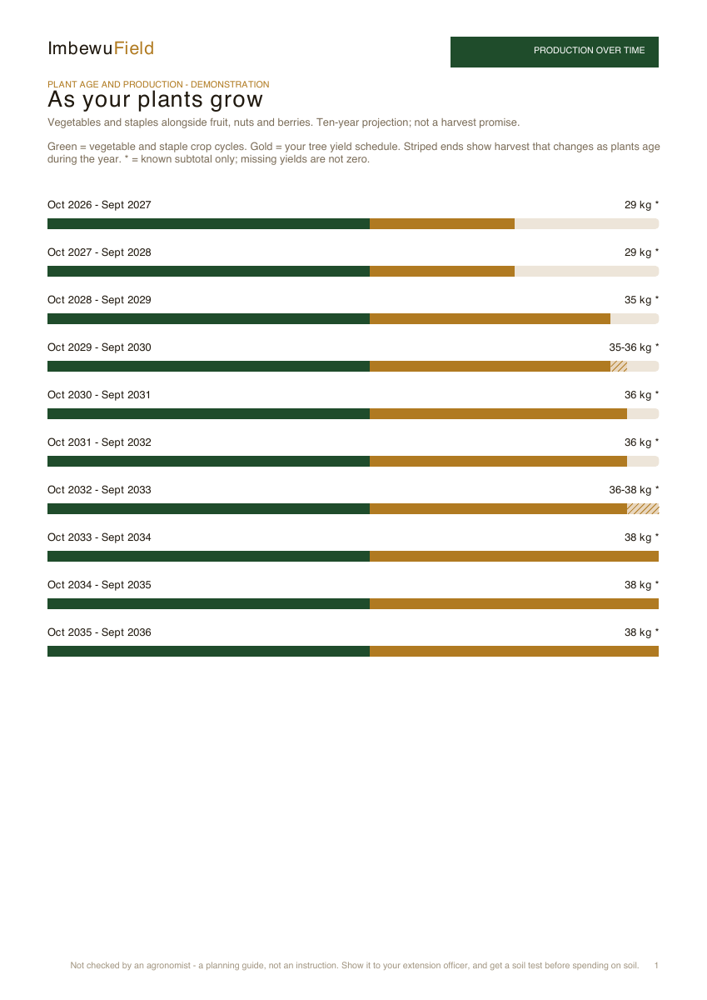
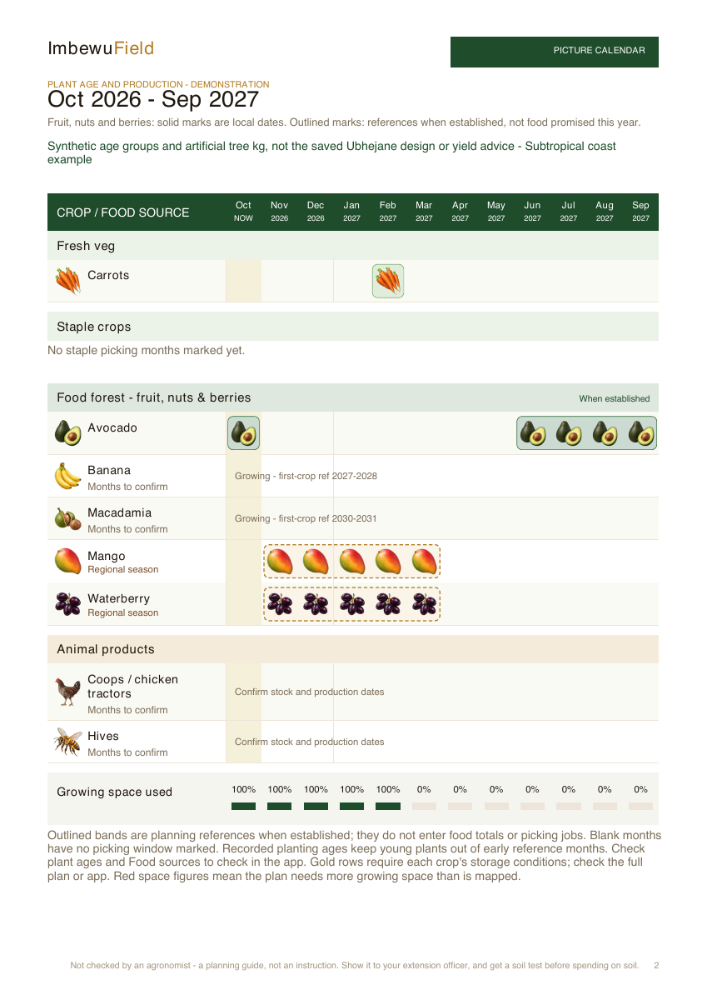

# Production plan re-audit — 2026-10-10

- Auditor: Codex, with parallel projection, animal-guidance and print reviewers.
- Reviewed revision: `cc4187244b03c69f6f2297a33b473cdeb12cfb8a`, branch `codex/production-reaudit-20261010`, with the local changes described below. The final branch/PR and deployment evidence are recorded in the shared [release ledger](https://github.com/rorymclark-prog/ImbewuField/issues/35).
- Deployment inspected: [ImbewuField production](https://imbewufield.vercel.app), build `cc4187244b03c69f6f2297a33b473cdeb12cfb8a` before these edits. This does not establish that the new branch has deployed.
- Previous audit: [Production by plant age and clearer graphics — 4 October](../2026-10-04/production-age-visuals-codex.md), carrying forward CP-026–CP-029 and its links to CP-017–CP-025.
- Scope: `/facilitator/crops`, the public sample, ten-year vegetable/perennial projections, animal product choices, source qualifications, native PDF exports and file delivery. The private saved Ubhejane design was not retrieved.
- Evidence type: current-source review, primary-source checks, targeted tests, rendered synthetic PDFs and browser checks recorded by the root reviewer. Publication is conditional on both exact-head CI jobs passing; the release ledger records that result.

## What was already done

CP-026's larger product icons and continuous outlined month bands remain. The default fruit art was still the SVG set; CP-043 now replaces all 36 existing product illustrations with shaded PNGs matching the vegetables. CP-027's separate plant-age cohorts, entered farm yield schedules and shared ten-year app/PDF model remain; researched mature yields still do not become automatic young-tree yields. CP-028's age qualification of established seasonal references remains distinct from observed picking dates. CP-029's month/year controls and tree-save warning remain.

The earlier product and regional work is retained: banana circles count as three planted bananas in the same banana group; no duplicate circle product row or saved geometry change; existing/proposed status is preserved; regional cultivar assumptions are labelled; actual picking dates replace references; eggs, milk, honey, meat and fish are distinct products; mapped housing does not imply animal numbers. Indigenous edible-part and pollination guidance, source links and missing data remain. This audit improves reproduced defects without claiming that every existing species has a validated local yield curve or cultivar recommendation.

The [4 October product research](../2026-10-04/production-products-codex.md) and [regional picture-calendar audit](../2026-10-04/regional-production-calendar-codex.md) remain historical evidence. The bee-registration statement based on the original 2013 text is superseded by the amended statutory source below; the other original claims are not silently rewritten.

## Findings and disposition

| ID | User-visible problem or coverage gap | Status | Evidence and next action |
| --- | --- | --- | --- |
| CP-030 | Two one-off crops using the same bed in different saved years could create a phantom conflict and erase future projected yields. A present conflict could also block all ten years. | Implemented; targeted verification | `datedPlantingSowIndex` and the shared dated bed-conflict walk keep occupation in the saved year and restrict conflict decisions to the relevant projection period. Regression fixtures retain production in separate future years and release later recurring years once an existing one-off finishes. |
| CP-031 | A crop harvested after a year boundary could escape a real bed conflict that occurred earlier in its own growing cycle. | Implemented; targeted verification | The projection checks the contributing crop's whole occupied cycle, including nursery/field timing, as well as the forecast period. A September conflict still blocks that crop's January picking total; later unrelated years remain usable. |
| CP-032 | Invalid sowing months, inconsistent year stamps, damaged bed areas and malformed age/yield drafts could create kilograms or calendar references that disagreed with each other. Duplicate age checkpoints could be hidden behind an immature zero. | Implemented; targeted verification | Invalid dates and areas are named as missing; negative/nonfinite ages and kg cannot override a calendar reference; duplicate checkpoints remain an explicit error before first-crop age. Calendar and kg paths use compatible validation rather than repairing the farmer's values. |
| CP-033 | Small positive production rounded to zero in app and printed kg labels. | Implemented; targeted verification | Shared `projectedKgLabel` retains small decimals, distinguishes zero from missing data and uses a less-than label for very small positive quantities. App detail and PDF read the same formatter. |
| CP-034 | Animal enterprise/month choices optimistically appeared saved when local storage was full, corrupt or blocked. A later month-only save could clear a warning while the enterprise remained unstored. | Verified by behavioral tests; storage failure remains device-test limited | Both save functions return real success. Both current enterprise choices and months are saved before clearing the alert. Account/site/sample isolation and all success/failure callback combinations are covered. Blocked loads stay usable. This remains device-local storage rather than cross-device synchronization. |
| CP-035 | Animal numeric cards discarded the source's conditions: dairy dry matter looked like fresh-feed weight, layer indoor space looked universal and foreign intensive productive-life figures looked like backyard lifespans. Dairy season text also turned a commercial processor supply requirement into a promise of year-round milk. | Implemented; source and targeted verification | Dairy season text now identifies commercial herd supply, excludes year-round lactation of every cow and requires confirming the farm's calving/milking months. Essential qualifiers appear beside facts; full `SourcedRange.note` remains expandable. Numeric values, their original units and sources are unchanged. [Source checks](evidence-production-reaudit/animal-source-checks.md) distinguish retained dossier context from newly fetched law. |
| CP-036 | Bee legal guidance still required annual January–March registration under the original law. | Implemented; primary-source verified | NDA's consolidated R.858 as amended by R.1511 of 22 November 2019 specifies a 24-month certificate, renewal at expiry, a valid certificate for activities/hired services and the complete mandatory record list. The bee dossier and generated table cite that source. Bee output, timing, feed, water and space quantities are unchanged. |
| CP-037 | Hive care lacked playground separation, water and dry-ground checks, which matter at a creche. | Implemented; primary-source verified | FAO's African apiary checklist supplies those points; the same bee welfare record reaches app and printed care. Safe local placement needs a registered beekeeper check. No exact distance, municipal permission or approval of the mapped hive location is inferred. |
| CP-038 | Calendar & jobs implicitly pulled in the ten-year projection and reference appendices, making the wall copy much longer than its purpose suggested. Future production lacked a separate export action. | Implemented; PDF verified | A separately selectable `projection` section preserves graph, age groups and sources in farmer/reference exports and a Future harvest PDF. Quick print omits availability appendices. Ordinary A4/A3/A2 quick-print fixtures are three pages; larger real plans may need more. |
| CP-039 | Many age groups, very long entered schedules and long farm names could print through the footer, lose late entries or obscure whether kg belonged to a species or cohort. | Implemented; PDF verified | Cohorts have their own headed table rows, species totals remain explicit, repeated headers wrap long names and schedule/source text paginates. A complete single cohort avoids an identical duplicate total. Sixty-group A4/A3/A2 and long-schedule fixtures retain the final group/checkpoint and source link inside page bounds. |
| CP-040 | A production range used the same solid bar as a fixed quantity, obscuring changes as plants aged within the year. | Verified in app/PDF examples | Solid gold represents the lower end; a striped tail shows the change to the upper end. App and PDF explain the same meaning and retain the explicit kg range. It is a range from entered checkpoints rather than a statistical confidence interval. |
| CP-041 | Export messages could claim sharing/opening when the actual result was cancellation or a fallback download. `noopener` could make a successful PDF tab look blocked and trigger a duplicate download. | Verified by behavioral tests and actual download/open checks | Delivery distinguishes shared, downloaded, cancelled and unavailable outcomes; explicit share actions use sharing; popup fallback states what happened. A new blank tab detaches its opener before navigating to the local PDF. No OS share-sheet or physical-device guarantee is claimed. |
| CP-042 | Export controls used light-only colours and small action targets, making the handoff harder to read in supported themes. | Verified in local responsive/theme examples | Export surfaces/text use theme tokens, primary forest actions use their foreground token and controls have 44-pixel minimum targets. Earth light and dark Slate examples were inspected at 320/390px; the main export action has 8.74:1 measured contrast. |


| CP-043 | Flat SVG fruit placeholders did not match the vegetable pictures, making products harder to recognise across the calendar. | Implemented; visually and asset-test verified | All 36 existing fruit, nut, berry and picked-leaf/pod products now use shaded 128px transparent PNGs. Every original, native-size contact and 18/24px thumbnail was inspected; file tests reject missing/opaque/empty/oversized art. SVGs remain available for future unwired products. Prompt/QA records are linked below. |
| CP-044 | Animal calendars used portraits or line symbols when the farmer needed to recognise eggs, milk, honey, meat or fish. Switching unknown housing to food pictures could imply a product that was never chosen. | Implemented; visually and mapping-test verified | Shared product artwork serves confirmed and undated chosen enterprises. The separate housing key keeps a portrait for unassigned/incompatible structures. Six product images include wool for enterprise use, while food totals continue excluding wool. Housing counts never become animal counts or production quantities. |
| CP-045 | Staples were mixed into the vegetable picture trays and their annual overview described maize and sweet potato as fresh vegetables; bar wording implied quantities. | Implemented; partition and rendered-output verified | App/PDF separate staples using the existing named staple authority. Fresh and stored status remains sourced. A 49-crop probe retained 1,703 entries exactly once; fresh/stored and scope-switch tests reject lost/duplicated crops. Annual-overview labels include staples and explain that bars count crop kinds, not kilograms or sufficient food. |
| CP-046 | A busy A4 calendar split a short animal-product group and left the last product on another page. | Implemented; pagination regression and visual verification | A whole category that fits a fresh page stays together; oversized categories still paginate with repeated headings. The combined vegetable/staple/fruit/nut/animal illustration tests this on A4/A3/A2. |

## Verification

- Typecheck: `npx tsc --noEmit` passed on the frozen integrated source, including the final copy and pagination fixes. A test regex keeps the existing TypeScript target.
- Full test suite: the complete registered `npm test` run was started locally with Node 24 and bounded concurrency for this busy Mac. Release requires the exact pushed revision's `test` and `rules` jobs to pass; that independent full-suite result is recorded in the release ledger. No incomplete local run is reported as passing.
- Targeted integrated check: **202/202 tests passed** across projection, animal choices/source qualifiers, actual PDF generation, availability/artwork, file delivery and app callbacks, including whole-band pagination and annual-overview regressions. Projection tests cover real dated conflicts, whole-cycle conflicts across a year boundary, bad stamps/areas, invalid checkpoints and small positive yields. Tests trace actual PDF text placement and final content rather than only non-empty bytes.
- Whitespace: integrated `git diff --check` clean before final documentation and repeated at release.
- PDF evidence: [bounds-check.json](evidence-production-reaudit-print/bounds-check.json) contains **25 synthetic PDFs, 116 pages, zero off-page text characters**. These cover eight SA climate-group examples plus unknown climate; ordinary, quick and future-only exports; changing yields; long titles; long schedules; and sixty age groups in A4/A3/A2. A coordinate check does not replace visual inspection. The print reviewer inspected the rendered evidence linked below.
- Browser evidence: local public-tour plan at `localhost:4252` inspected in Earth light and dark Slate at 320/390px, with no page overflow. The separate staple row opens correct March maize/sweet-potato detail and sourced garlic storage. A real Future harvest PDF downloaded and was rendered/inspected; Calendar & jobs opened exactly one new PDF tab with the correct status. Blob-viewer pixels could not be inspected through the browser tool. A requested desktop override did not apply to the bound tab, so no desktop proof is inferred from that request. Responsive evidence is linked below.
- Publication: finished branch `codex/production-reaudit-20261010`; the [shared ledger](https://github.com/rorymclark-prog/ImbewuField/issues/35) records the PR, final SHA, both CI job conclusions and verified deployed builds. This branch audit by itself does not establish a production deployment.
- Other limits: no private Ubhejane save/reopen, physical printer check, fluent isiZulu review, OS sharing guarantee or paid report generation. No assumption that every plant suits every climate or that a regional source is a trial at this farm. The eight climate fixtures remain synthetic examples.

### App and artwork evidence

The dairy screenshot predates the final season paragraph: it records the numeric qualifiers, while the corrected commercial-herd season wording is verified by source review and regression tests.

[Staple row on a phone viewport](evidence-production-reaudit/app-staple-calendar-phone.png) · [Age range in dark Slate](evidence-production-reaudit/app-phone-range-slate.png) · [Export actions in Earth light](evidence-production-reaudit/app-export-earth-light.png) · [Dairy qualifiers](evidence-production-reaudit/app-animal-dairy-phone.png) · [Honey qualifiers](evidence-production-reaudit/app-animal-hive-phone.png)

[First 12 product illustrations](evidence-production-reaudit/fruit-first12-contact.png) · [Middle 12 on light/dark](evidence-production-reaudit/art-middle12-contact.png) · [Last 12 on light/dark](evidence-production-reaudit/art-last12-contact.png) · [Animal products beside vegetable art](evidence-production-reaudit/art-animal-product-size-check.png)

[First 12 prompts](evidence-production-reaudit/art-prompts-first12.md) · [Middle 12 prompts](evidence-production-reaudit/art-prompts-middle12.md) · [Last 12 prompts](evidence-production-reaudit/art-prompts-last12.md) · [Animal product provenance](evidence-production-reaudit/art-prompts-animal-products.md)

### Print evidence

[Combined food calendar](evidence-production-reaudit-print/all-produce-a2-1.png) · [A4 staple rows](evidence-production-reaudit-print/all-produce-a4-1.png) · [A4 animal products together](evidence-production-reaudit-print/all-produce-a4-3.png) · [Synthetic fixture explanation](evidence-production-reaudit-print/all-produce-demonstration.md)






[Eight climate groups and unknown-climate control](evidence-production-reaudit-print/regional-contact.png) · [Sixty-group continuation](evidence-production-reaudit-print/sixty-age-groups-a4-10.png) · [Long schedule and source continuation](evidence-production-reaudit-print/long-yield-schedule-4.png)

Reproduce synthetic print fixtures with Node 24 and the alias loader:

```sh
node --import ./tests/register-alias.mjs docs/audits/2026-10-10/render-production-print.mjs output/pdf/production-reaudit-2026-10-10
node --import ./tests/register-alias.mjs docs/audits/2026-10-04/evidence-regional-calendar/render-fixture.mjs output/pdf/production-reaudit-2026-10-10/regional
```

The fixture script labels artificial tree kg and climate examples. Those values are not recommended farm yields or Rory's recorded production.

This changes the picture. `PLAN_VERSION` remains unchanged. Saved geometry, plant species names, course bodies and deployment workflows are unchanged. No new yield, rainfall, stocking, spacing or feed quantity was invented. Vegetable benchmarks still require revising area, water and management assumptions as the orchard grows; animal output is not mixed into crop kg.

## Next continuation

1. Consult the linked release ledger for the final PR/CI/deployment state. Final publication requires both CI jobs green and a matching live build; branch evidence is not substituted for that check.
2. Continue the [site survey audit](../2026-10-02/site-survey-continuation.md) with actual animal stock, planting dates, nursery provenance, local cultivar/chilling/pollination checks, soil, dry-season water and validated farm yield schedules. Accept only fields that preserve known/unknown distinctions and do not derive stock counts from housing.
3. Verify the private Ubhejane design and save/reopen flow when its actual data and access are available. Its banana/hive/coop placements cannot be certified from public sample fixtures.
4. Commission fluent review for farming/export wording in isiZulu and perform real phone sharing/printing checks. Keep these coverage gaps explicit until those checks are performed.
